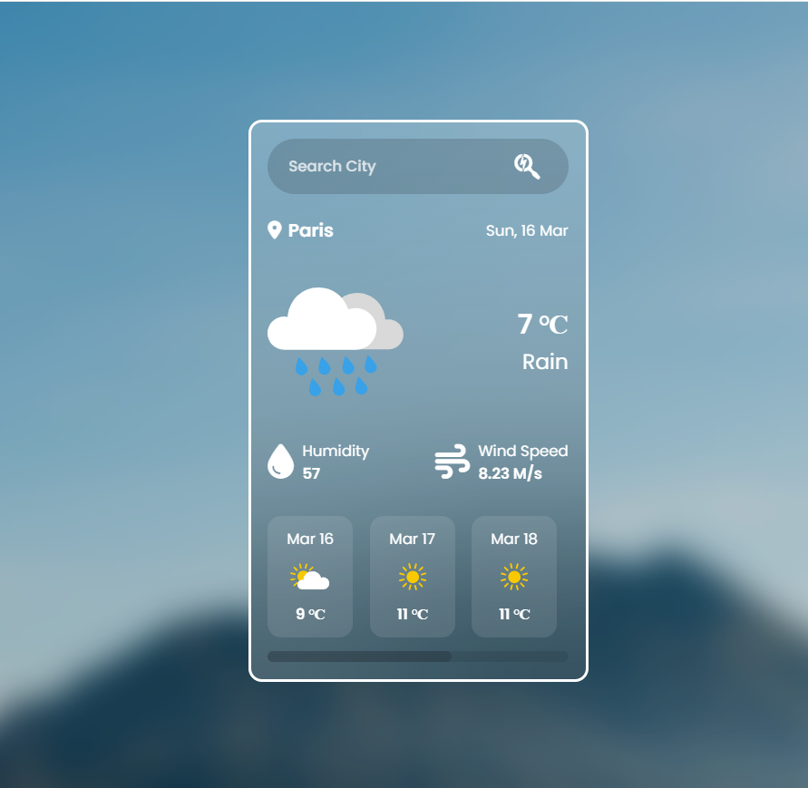

# 🌦 Weather Application  

## 🚀 Live Demo  
🔗 [Click here to view the live project](https://effulgent-bublanina-76b121.netlify.app/)  

## 📂 GitHub Repository  
🔗 [View Source Code on GitHub](https://github.com/muhammadrakib2299/Weather_Application_Using_JS)  

## 📌 Project Description  
This **Weather Application** allows users to check real-time weather conditions by simply entering a city name. The app fetches data from a **free Weather API** and displays the current weather, along with a **5-day forecast**. If the city is not found, a user-friendly **error page** is displayed.  

## 🛠️ Features  
✔ **Search for any city** 🌍  
✔ **Real-time weather details** with icons ⛅  
✔ **Current weather information**:  
   - City Name & Current Date 📅  
   - Temperature 🌡️  
   - Weather Condition with Icon 🌥️  
   - Humidity 💧  
   - Wind Speed 🌬️  
✔ **5-Day Weather Forecast** 📆  
✔ **Error Handling** – Displays a "City Not Found" message if the input is invalid ❌  

## 🏗️ Built With  
✅ **HTML5** – Structure  
✅ **CSS3** – Styling  
✅ **Tailwind CSS** – Responsive UI  
✅ **JavaScript (ES6)** – Functionality  
✅ **OpenWeatherMap API** – Fetching real-time weather data  
✅ **Google Fonts & FontAwesome Icons** – UI Enhancements  

## 📸 Screenshots  
)  

## 🚀 Deployment  
This project is deployed on **Netlify**.  
🔗 [Live Demo on Netlify](https://effulgent-bublanina-76b121.netlify.app/)  
